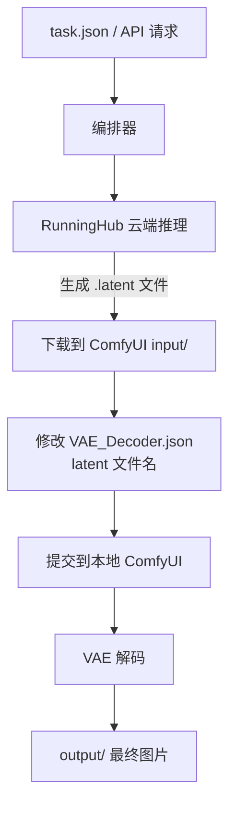

# Hood — AI 工作流编排工具 / 后端服务

将 [RunningHub](https://www.runninghub.cn) 云端推理与本地 ComfyUI VAE 解码串联为一条完整流水线。
提供 **CLI 工具** 和 **HTTP API 服务** 两种使用方式。

---

## 目录

- [快速开始](#快速开始)
- [API 文档](#api-文档)
- [CLI 使用](#cli-使用)
- [工作流程](#工作流程)
- [项目结构](#项目结构)

---

## 快速开始

### 1. 安装依赖

```bash
uv sync
```

### 2. 配置

在项目根目录创建 `.env` 文件（参考 `.env.example`）：

```env
# RunningHub API 密钥 — 从 https://www.runninghub.cn 控制台获取
RUNNINGHUB_API_KEY=你的密钥

# 本地 ComfyUI 配置
COMFYUI_SERVER=127.0.0.1:8188
COMFYUI_INPUT_DIR=D:/path/to/ComfyUI/input
```

> `.env` 已在 `.gitignore` 中，不会误提交到 Git。

### 3. 准备 ComfyUI 环境

- 确保本地 ComfyUI 已启动（默认 `127.0.0.1:8188`）
- VAE 模型放在 ComfyUI 的 `models/vae/` 目录下

### 4. 启动 API 服务

```bash
uv run uvicorn app.main:app --host 0.0.0.0 --port 8000 --reload
```

启动后访问：
- API 交互文档：http://localhost:8000/docs
- 健康检查：http://localhost:8000/api/health

---

## API 文档

所有 API 端点都以 `/api` 为前缀。异步任务端点（`POST /api/run`、`POST /api/decode`）立即返回 `task_id`，
客户端通过 `GET /api/tasks/{task_id}` 轮询任务状态。

### `GET /api/health` — 健康检查

**响应 200：**
```json
{
  "status": "ok",
  "version": "0.1.0"
}
```

---

### `POST /api/info` — 获取节点信息

查看 RunningHub 应用的节点列表。

**请求体：**
```json
{
  "webapp_id": "1937084629516193794"
}
```

**响应 200：**
```json
{
  "code": 0,
  "data": [
    {
      "nodeId": "22",
      "fieldName": "positive",
      "fieldType": "TEXT",
      "fieldValue": "..."
    }
  ]
}
```

**错误：**
- `400` — API 密钥未配置（ConfigError）
- `502` — RunningHub API 调用失败

---

### `POST /api/run` — 提交完整流水线

修改节点参数 → 提交 RunningHub 云端推理 → 下载 latent → 本地 ComfyUI VAE 解码。

异步任务，返回 `202 Accepted`。

**请求体：**
```json
{
  "webapp_id": "1937084629516193794",
  "modifications": [
    {
      "node_id": "22",
      "field_name": "positive",
      "field_value": "一只可爱的猫"
    },
    {
      "node_id": "33",
      "field_name": "image",
      "file_path": "D:/images/cat.jpg"
    }
  ]
}
```

**响应 202：**
```json
{
  "task_id": "550e8400-e29b-41d4-a716-446655440000",
  "status": "pending",
  "created_at": 1718000000.0,
  "updated_at": 1718000000.0,
  "message": "任务已创建，等待执行",
  "output_files": []
}
```

---

### `POST /api/decode` — 独立 VAE 解码

将 `.latent` 文件送入本地 ComfyUI 解码为图片。异步任务，返回 `202 Accepted`。

**请求体：**
```json
{
  "latent_file": "D:/ComfyUI/input/123456.latent",
  "output_dir": null
}
```

**响应 202：** 同 `/api/run` 格式。

---

### `GET /api/tasks/{task_id}` — 查询任务状态

轮询异步任务的执行进度和结果。

**响应 200（进行中）：**
```json
{
  "task_id": "550e8400-e29b-41d4-a716-446655440000",
  "status": "running",
  "message": "正在获取节点信息...",
  "output_files": []
}
```

**响应 200（已完成）：**
```json
{
  "task_id": "550e8400-e29b-41d4-a716-446655440000",
  "status": "done",
  "message": "流水线全部完成",
  "output_files": [
    "output/node_6"
  ]
}
```

**响应 200（失败）：**
```json
{
  "task_id": "550e8400-e29b-41d4-a716-446655440000",
  "status": "failed",
  "message": "提交任务失败: ...",
  "output_files": []
}
```

**错误：** `404` — task_id 不存在

---

## CLI 使用

保留原有 CLI 方式，无需启动 HTTP 服务即可直接运行。

### 完整流水线（默认）

```bash
uv run python main.py
# 或显式指定配置文件：
uv run python main.py run [task.json]
```

### 仅查看节点信息

```bash
uv run python main.py info <webappId>
```

`webappId` 是 AI 应用详情页 URL 末尾的数字，例如 `https://www.runninghub.cn/ai-detail/1937084629516193794` 中的 `1937084629516193794`。

### 独立本地解码

```bash
uv run python main.py decode <latent_file>
```

### 命令参考

| 命令 | 说明 |
|------|------|
| `uv run python main.py` | **默认**完整流水线（等效于 `run`） |
| `uv run python main.py run [task.json]` | 完整流水线：提交云端 → 下载 latent → 本地解码 |
| `uv run python main.py info <webappId>` | 查看 RunningHub 应用的节点信息 |
| `uv run python main.py decode <latent_file>` | 独立的本地 ComfyUI VAE 解码 |

---

## task.json 配置说明

```json
{
  "webappId": "1937084629516193794",
  "modifications": [
    {
      "nodeId": "node_xxx",
      "fieldName": "prompt",
      "fieldValue": "一只可爱的猫"
    },
    {
      "nodeId": "node_yyy",
      "fieldName": "image",
      "filePath": "D:/images/cat.jpg"
    }
  ]
}
```

- **webappId**: 必填，AI 应用的 ID
- **modifications**: 必填，要修改的节点列表
  - **nodeId**: 节点 ID
  - **fieldName**: 字段名称
  - **fieldValue**: 文本节点的值（文本/下拉选择等类型使用）
  - **filePath**: 文件路径（图片/音频/视频节点使用，自动上传到 RunningHub）

> 先用 `info` 命令查看节点列表，就能知道有哪些 `nodeId`、`fieldName` 和 `fieldType` 可以修改。

---

## 工作流程



---

## 项目结构

```
Hood/
├── app/                    # FastAPI 后端服务
│   ├── __init__.py
│   ├── main.py             # FastAPI 应用入口 + CORS
│   ├── routes.py           # REST API 路由
│   ├── models.py           # Pydantic 请求/响应模型
│   └── services.py         # 业务服务层（CLI 与 API 共用）
├── main.py                 # CLI 编排器（info / run / decode）
├── runninghub.py           # RunningHub API 客户端
├── comfyui.py              # 本地 ComfyUI 客户端
├── VAE_Decoder.json        # VAE 解码工作流模板
├── task.json               # RunningHub 任务配置
├── .env                    # 环境配置（API 密钥 + ComfyUI 路径）
├── .env.example            # 配置示例
├── pyproject.toml          # 项目配置
├── output/                 # 解码结果图片
└── README.md
```
