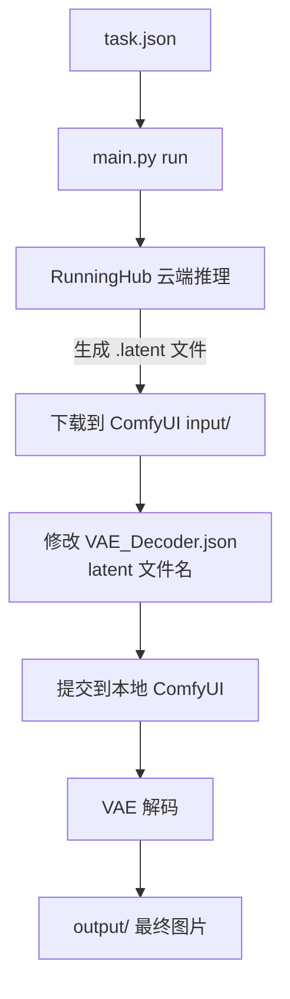

# Hood — AI 工作流编排工具

将 [RunningHub](https://www.runninghub.cn) 云端推理与本地 ComfyUI VAE 解码串联为一条完整流水线。

## 快速开始

### 1. 安装依赖

```bash
uv sync
```

### 2. 配置

在项目根目录创建 `.env` 文件（参考 `.env.example`）：

```env
# RunningHub API 密钥 — 从 https://www.runninghub.cn 控制台获取
RUNNINGHUB_API_KEY=你的密钥

# 本地 ComfyUI 配置
COMFYUI_SERVER=127.0.0.1:8188
COMFYUI_INPUT_DIR=D:/path/to/ComfyUI/input
```

> `.env` 已在 `.gitignore` 中，不会误提交到 Git。

### 3. 准备 ComfyUI 环境

- 确保本地 ComfyUI 已启动（默认 `127.0.0.1:8188`）
- VAE 模型放在 ComfyUI 的 `models/vae/` 目录下

## 使用

### 完整流水线（默认）

```bash
uv run python main.py
```

或显式指定：

```bash
uv run python main.py run [task.json]
```

流程：
1. 读取 `task.json`，修改节点参数
2. 提交到 RunningHub 云端执行
3. 轮询等待完成
4. 下载输出的 `.latent` 文件**直接到 ComfyUI input/ 目录**
5. 自动调用本地 ComfyUI 进行 VAE 解码
6. 最终图片保存到 `output/` 目录

### 仅查看节点信息

```bash
uv run python main.py info <webappId>
```

`webappId` 是 AI 应用详情页 URL 末尾的数字，例如 `https://www.runninghub.cn/ai-detail/1937084629516193794` 中的 `1937084629516193794`。

### 独立本地解码

已有 `.latent` 文件时，可单独执行 VAE 解码：

```bash
uv run python main.py decode <latent_file>
```

## task.json 配置说明

```json
{
  "webappId": "1937084629516193794",
  "modifications": [
    {
      "nodeId": "node_xxx",
      "fieldName": "prompt",
      "fieldValue": "一只可爱的猫"
    },
    {
      "nodeId": "node_yyy",
      "fieldName": "image",
      "filePath": "D:/images/cat.jpg"
    }
  ]
}
```

- **webappId**: 必填，AI 应用的 ID
- **modifications**: 必填，要修改的节点列表
  - **nodeId**: 节点 ID
  - **fieldName**: 字段名称
  - **fieldValue**: 文本节点的值（文本/下拉选择等类型使用）
  - **filePath**: 文件路径（图片/音频/视频节点使用，自动上传到 RunningHub）

> 先用 `info` 命令查看节点列表，就能知道有哪些 `nodeId`、`fieldName` 和 `fieldType` 可以修改。

## 命令参考

| 命令 | 说明 |
|------|------|
| `uv run python main.py` | **默认**完整流水线（等效于 `run`） |
| `uv run python main.py run [task.json]` | 完整流水线：提交云端 → 下载 latent → 本地解码 |
| `uv run python main.py info <webappId>` | 查看 RunningHub 应用的节点信息 |
| `uv run python main.py decode <latent_file>` | 独立的本地 ComfyUI VAE 解码 |

## 工作流程



## 项目结构

```
Hood/
├── main.py               # CLI 编排器（info / run / decode）
├── runninghub.py          # RunningHub API 客户端
├── comfyui.py             # 本地 ComfyUI 客户端
├── VAE_Decoder.json       # VAE 解码工作流模板
├── task.json              # RunningHub 任务配置
├── .env                   # 环境配置（API 密钥 + ComfyUI 路径）
├── .env.example           # 配置示例
├── pyproject.toml         # 项目配置
├── output/                # 解码结果图片
├── download/              # 其他下载文件
└── README.md
```
